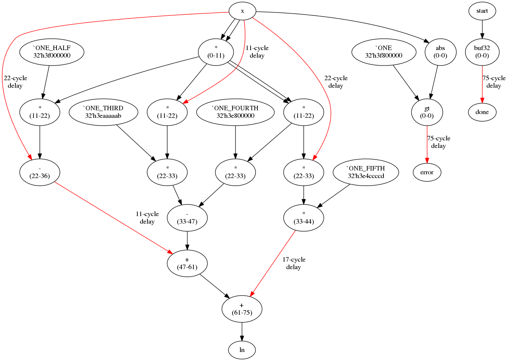

# Automatically turns this:

```
mod	ln_fast_core

def	*	11	mult11 {inst}(clk, {inputs}, {output});	[31:0]
def	+	14	add14 {inst}(clk, {inputs}, {output});	[31:0]
def	-	14	sub14 {inst}(clk, {inputs}, {output});	[31:0]

const	ONE	32'h3f800000
const	ONE_HALF	32'h3f000000
const	ONE_THIRD	32'h3eaaaaab
const	ONE_FOURTH	32'h3e800000
const	ONE_FIFTH	32'h3e4ccccd

clk	clk
rst_n	rst_n
in	x	[31:0]
in	start
out	ln	[31:0]
out	done
out	error

def	buf32	0	assign {output} = {inputs};	[31:0]
inst	buf32	done	start

def	abs	0	assign {output} = {{1'b0, {inputs}[30:0]}};	[31:0]
def	gt	0	assign {output} = {input_a[0]} > {input_a[1]};
inst	abs	x_abs	x
inst	gt	error	x_abs	ONE

inst	*	e2	x	x
inst	*	t2	e2	ONE_HALF
inst	*	e3	e2	x
inst	*	e4	e2	e2
inst	-	s12	x	t2
inst	*	e5	e4	x
inst	*	t3	e3	ONE_THIRD
inst	*	t4	e4	ONE_FOURTH
inst	-	s34	t3	t4
inst	*	t5	e5	ONE_FIFTH
inst	+	s1234	s12	s34
inst	+	ln	s1234	t5
```

# Into this:



# And this:

```
// 75-cycle ln_fast_core

`define ONE_HALF 32'h3f000000
`define ONE_THIRD 32'h3eaaaaab
`define ONE_FOURTH 32'h3e800000
`define ONE_FIFTH 32'h3e4ccccd
`define ONE 32'h3f800000

module ln_fast_core(input  clk, input  rst_n, input [31:0] x, input  start, output [31:0] ln, output  done, output  error);

wire [31:0] ln_75;
wire [31:0] s12_36;
reg [31:0] s12_37, s12_38, s12_39, s12_40, s12_41, s12_42, s12_43, s12_44, s12_45, s12_46, s12_47;
wire [31:0] e4_22;
wire [31:0] t5_44;
reg [31:0] t5_45, t5_46, t5_47, t5_48, t5_49, t5_50, t5_51, t5_52, t5_53, t5_54, t5_55, t5_56, t5_57, t5_58, t5_59, t5_60, t5_61;
wire [31:0] t2_22;
wire [31:0] t3_33;
wire [31:0] s34_47;
wire  start_0;
wire  done_0;
reg  done_1, done_2, done_3, done_4, done_5, done_6, done_7, done_8, done_9, done_10, done_11, done_12, done_13, done_14, done_15, done_16, done_17, done_18, done_19, done_20, done_21, done_22, done_23, done_24, done_25, done_26, done_27, done_28, done_29, done_30, done_31, done_32, done_33, done_34, done_35, done_36, done_37, done_38, done_39, done_40, done_41, done_42, done_43, done_44, done_45, done_46, done_47, done_48, done_49, done_50, done_51, done_52, done_53, done_54, done_55, done_56, done_57, done_58, done_59, done_60, done_61, done_62, done_63, done_64, done_65, done_66, done_67, done_68, done_69, done_70, done_71, done_72, done_73, done_74, done_75;
wire [31:0] s1234_61;
wire  error_0;
reg  error_1, error_2, error_3, error_4, error_5, error_6, error_7, error_8, error_9, error_10, error_11, error_12, error_13, error_14, error_15, error_16, error_17, error_18, error_19, error_20, error_21, error_22, error_23, error_24, error_25, error_26, error_27, error_28, error_29, error_30, error_31, error_32, error_33, error_34, error_35, error_36, error_37, error_38, error_39, error_40, error_41, error_42, error_43, error_44, error_45, error_46, error_47, error_48, error_49, error_50, error_51, error_52, error_53, error_54, error_55, error_56, error_57, error_58, error_59, error_60, error_61, error_62, error_63, error_64, error_65, error_66, error_67, error_68, error_69, error_70, error_71, error_72, error_73, error_74, error_75;
wire [31:0] e5_33;
wire [31:0] x_0;
reg [31:0] x_1, x_2, x_3, x_4, x_5, x_6, x_7, x_8, x_9, x_10, x_11, x_12, x_13, x_14, x_15, x_16, x_17, x_18, x_19, x_20, x_21, x_22;
wire [31:0] x_abs_0;
wire [31:0] t4_33;
wire [31:0] e3_22;
wire [31:0] e2_11;

assign x_0 = x;
assign start_0 = start;
assign ln = ln_75;
assign done = done_75;
assign error = error_75;

assign done_0 = start_0;
assign x_abs_0 = {1'b0, x_0[30:0]};
assign error_0 = x_abs_0 > `ONE;
mult11 u3(clk, x_0, x_0, e2_11);
mult11 u4(clk, e2_11, `ONE_HALF, t2_22);
mult11 u5(clk, e2_11, x_11, e3_22);
mult11 u6(clk, e2_11, e2_11, e4_22);
sub14 u7(clk, x_22, t2_22, s12_36);
mult11 u8(clk, e4_22, x_22, e5_33);
mult11 u9(clk, e3_22, `ONE_THIRD, t3_33);
mult11 u10(clk, e4_22, `ONE_FOURTH, t4_33);
sub14 u11(clk, t3_33, t4_33, s34_47);
mult11 u12(clk, e5_33, `ONE_FIFTH, t5_44);
add14 u13(clk, s12_47, s34_47, s1234_61);
add14 u14(clk, s1234_61, t5_61, ln_75);

always @(posedge clk) begin
	if (~rst_n) begin
		s12_37 <= 0;
		s12_38 <= 0;
		s12_39 <= 0;
		s12_40 <= 0;
		s12_41 <= 0;
		s12_42 <= 0;
		s12_43 <= 0;
		s12_44 <= 0;
		s12_45 <= 0;
		s12_46 <= 0;
		s12_47 <= 0;
		t5_45 <= 0;
		t5_46 <= 0;
		t5_47 <= 0;
		t5_48 <= 0;
		t5_49 <= 0;
		t5_50 <= 0;
		t5_51 <= 0;
		t5_52 <= 0;
		t5_53 <= 0;
		t5_54 <= 0;
		t5_55 <= 0;
		t5_56 <= 0;
		t5_57 <= 0;
		t5_58 <= 0;
		t5_59 <= 0;
		t5_60 <= 0;
		t5_61 <= 0;
		done_1 <= 0;
		done_2 <= 0;
		done_3 <= 0;
		done_4 <= 0;
		done_5 <= 0;
		done_6 <= 0;
		done_7 <= 0;
		done_8 <= 0;
		done_9 <= 0;
		done_10 <= 0;
		done_11 <= 0;
		done_12 <= 0;
		done_13 <= 0;
		done_14 <= 0;
		done_15 <= 0;
		done_16 <= 0;
		done_17 <= 0;
		done_18 <= 0;
		done_19 <= 0;
		done_20 <= 0;
		done_21 <= 0;
		done_22 <= 0;
		done_23 <= 0;
		done_24 <= 0;
		done_25 <= 0;
		done_26 <= 0;
		done_27 <= 0;
		done_28 <= 0;
		done_29 <= 0;
		done_30 <= 0;
		done_31 <= 0;
		done_32 <= 0;
		done_33 <= 0;
		done_34 <= 0;
		done_35 <= 0;
		done_36 <= 0;
		done_37 <= 0;
		done_38 <= 0;
		done_39 <= 0;
		done_40 <= 0;
		done_41 <= 0;
		done_42 <= 0;
		done_43 <= 0;
		done_44 <= 0;
		done_45 <= 0;
		done_46 <= 0;
		done_47 <= 0;
		done_48 <= 0;
		done_49 <= 0;
		done_50 <= 0;
		done_51 <= 0;
		done_52 <= 0;
		done_53 <= 0;
		done_54 <= 0;
		done_55 <= 0;
		done_56 <= 0;
		done_57 <= 0;
		done_58 <= 0;
		done_59 <= 0;
		done_60 <= 0;
		done_61 <= 0;
		done_62 <= 0;
		done_63 <= 0;
		done_64 <= 0;
		done_65 <= 0;
		done_66 <= 0;
		done_67 <= 0;
		done_68 <= 0;
		done_69 <= 0;
		done_70 <= 0;
		done_71 <= 0;
		done_72 <= 0;
		done_73 <= 0;
		done_74 <= 0;
		done_75 <= 0;
		error_1 <= 0;
		error_2 <= 0;
		error_3 <= 0;
		error_4 <= 0;
		error_5 <= 0;
		error_6 <= 0;
		error_7 <= 0;
		error_8 <= 0;
		error_9 <= 0;
		error_10 <= 0;
		error_11 <= 0;
		error_12 <= 0;
		error_13 <= 0;
		error_14 <= 0;
		error_15 <= 0;
		error_16 <= 0;
		error_17 <= 0;
		error_18 <= 0;
		error_19 <= 0;
		error_20 <= 0;
		error_21 <= 0;
		error_22 <= 0;
		error_23 <= 0;
		error_24 <= 0;
		error_25 <= 0;
		error_26 <= 0;
		error_27 <= 0;
		error_28 <= 0;
		error_29 <= 0;
		error_30 <= 0;
		error_31 <= 0;
		error_32 <= 0;
		error_33 <= 0;
		error_34 <= 0;
		error_35 <= 0;
		error_36 <= 0;
		error_37 <= 0;
		error_38 <= 0;
		error_39 <= 0;
		error_40 <= 0;
		error_41 <= 0;
		error_42 <= 0;
		error_43 <= 0;
		error_44 <= 0;
		error_45 <= 0;
		error_46 <= 0;
		error_47 <= 0;
		error_48 <= 0;
		error_49 <= 0;
		error_50 <= 0;
		error_51 <= 0;
		error_52 <= 0;
		error_53 <= 0;
		error_54 <= 0;
		error_55 <= 0;
		error_56 <= 0;
		error_57 <= 0;
		error_58 <= 0;
		error_59 <= 0;
		error_60 <= 0;
		error_61 <= 0;
		error_62 <= 0;
		error_63 <= 0;
		error_64 <= 0;
		error_65 <= 0;
		error_66 <= 0;
		error_67 <= 0;
		error_68 <= 0;
		error_69 <= 0;
		error_70 <= 0;
		error_71 <= 0;
		error_72 <= 0;
		error_73 <= 0;
		error_74 <= 0;
		error_75 <= 0;
		x_1 <= 0;
		x_2 <= 0;
		x_3 <= 0;
		x_4 <= 0;
		x_5 <= 0;
		x_6 <= 0;
		x_7 <= 0;
		x_8 <= 0;
		x_9 <= 0;
		x_10 <= 0;
		x_11 <= 0;
		x_12 <= 0;
		x_13 <= 0;
		x_14 <= 0;
		x_15 <= 0;
		x_16 <= 0;
		x_17 <= 0;
		x_18 <= 0;
		x_19 <= 0;
		x_20 <= 0;
		x_21 <= 0;
		x_22 <= 0;
	end else begin
		s12_37 <= s12_36;
		s12_38 <= s12_37;
		s12_39 <= s12_38;
		s12_40 <= s12_39;
		s12_41 <= s12_40;
		s12_42 <= s12_41;
		s12_43 <= s12_42;
		s12_44 <= s12_43;
		s12_45 <= s12_44;
		s12_46 <= s12_45;
		s12_47 <= s12_46;
		t5_45 <= t5_44;
		t5_46 <= t5_45;
		t5_47 <= t5_46;
		t5_48 <= t5_47;
		t5_49 <= t5_48;
		t5_50 <= t5_49;
		t5_51 <= t5_50;
		t5_52 <= t5_51;
		t5_53 <= t5_52;
		t5_54 <= t5_53;
		t5_55 <= t5_54;
		t5_56 <= t5_55;
		t5_57 <= t5_56;
		t5_58 <= t5_57;
		t5_59 <= t5_58;
		t5_60 <= t5_59;
		t5_61 <= t5_60;
		done_1 <= done_0;
		done_2 <= done_1;
		done_3 <= done_2;
		done_4 <= done_3;
		done_5 <= done_4;
		done_6 <= done_5;
		done_7 <= done_6;
		done_8 <= done_7;
		done_9 <= done_8;
		done_10 <= done_9;
		done_11 <= done_10;
		done_12 <= done_11;
		done_13 <= done_12;
		done_14 <= done_13;
		done_15 <= done_14;
		done_16 <= done_15;
		done_17 <= done_16;
		done_18 <= done_17;
		done_19 <= done_18;
		done_20 <= done_19;
		done_21 <= done_20;
		done_22 <= done_21;
		done_23 <= done_22;
		done_24 <= done_23;
		done_25 <= done_24;
		done_26 <= done_25;
		done_27 <= done_26;
		done_28 <= done_27;
		done_29 <= done_28;
		done_30 <= done_29;
		done_31 <= done_30;
		done_32 <= done_31;
		done_33 <= done_32;
		done_34 <= done_33;
		done_35 <= done_34;
		done_36 <= done_35;
		done_37 <= done_36;
		done_38 <= done_37;
		done_39 <= done_38;
		done_40 <= done_39;
		done_41 <= done_40;
		done_42 <= done_41;
		done_43 <= done_42;
		done_44 <= done_43;
		done_45 <= done_44;
		done_46 <= done_45;
		done_47 <= done_46;
		done_48 <= done_47;
		done_49 <= done_48;
		done_50 <= done_49;
		done_51 <= done_50;
		done_52 <= done_51;
		done_53 <= done_52;
		done_54 <= done_53;
		done_55 <= done_54;
		done_56 <= done_55;
		done_57 <= done_56;
		done_58 <= done_57;
		done_59 <= done_58;
		done_60 <= done_59;
		done_61 <= done_60;
		done_62 <= done_61;
		done_63 <= done_62;
		done_64 <= done_63;
		done_65 <= done_64;
		done_66 <= done_65;
		done_67 <= done_66;
		done_68 <= done_67;
		done_69 <= done_68;
		done_70 <= done_69;
		done_71 <= done_70;
		done_72 <= done_71;
		done_73 <= done_72;
		done_74 <= done_73;
		done_75 <= done_74;
		error_1 <= error_0;
		error_2 <= error_1;
		error_3 <= error_2;
		error_4 <= error_3;
		error_5 <= error_4;
		error_6 <= error_5;
		error_7 <= error_6;
		error_8 <= error_7;
		error_9 <= error_8;
		error_10 <= error_9;
		error_11 <= error_10;
		error_12 <= error_11;
		error_13 <= error_12;
		error_14 <= error_13;
		error_15 <= error_14;
		error_16 <= error_15;
		error_17 <= error_16;
		error_18 <= error_17;
		error_19 <= error_18;
		error_20 <= error_19;
		error_21 <= error_20;
		error_22 <= error_21;
		error_23 <= error_22;
		error_24 <= error_23;
		error_25 <= error_24;
		error_26 <= error_25;
		error_27 <= error_26;
		error_28 <= error_27;
		error_29 <= error_28;
		error_30 <= error_29;
		error_31 <= error_30;
		error_32 <= error_31;
		error_33 <= error_32;
		error_34 <= error_33;
		error_35 <= error_34;
		error_36 <= error_35;
		error_37 <= error_36;
		error_38 <= error_37;
		error_39 <= error_38;
		error_40 <= error_39;
		error_41 <= error_40;
		error_42 <= error_41;
		error_43 <= error_42;
		error_44 <= error_43;
		error_45 <= error_44;
		error_46 <= error_45;
		error_47 <= error_46;
		error_48 <= error_47;
		error_49 <= error_48;
		error_50 <= error_49;
		error_51 <= error_50;
		error_52 <= error_51;
		error_53 <= error_52;
		error_54 <= error_53;
		error_55 <= error_54;
		error_56 <= error_55;
		error_57 <= error_56;
		error_58 <= error_57;
		error_59 <= error_58;
		error_60 <= error_59;
		error_61 <= error_60;
		error_62 <= error_61;
		error_63 <= error_62;
		error_64 <= error_63;
		error_65 <= error_64;
		error_66 <= error_65;
		error_67 <= error_66;
		error_68 <= error_67;
		error_69 <= error_68;
		error_70 <= error_69;
		error_71 <= error_70;
		error_72 <= error_71;
		error_73 <= error_72;
		error_74 <= error_73;
		error_75 <= error_74;
		x_1 <= x_0;
		x_2 <= x_1;
		x_3 <= x_2;
		x_4 <= x_3;
		x_5 <= x_4;
		x_6 <= x_5;
		x_7 <= x_6;
		x_8 <= x_7;
		x_9 <= x_8;
		x_10 <= x_9;
		x_11 <= x_10;
		x_12 <= x_11;
		x_13 <= x_12;
		x_14 <= x_13;
		x_15 <= x_14;
		x_16 <= x_15;
		x_17 <= x_16;
		x_18 <= x_17;
		x_19 <= x_18;
		x_20 <= x_19;
		x_21 <= x_20;
		x_22 <= x_21;
	end
end

endmodule
```
